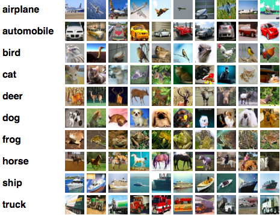
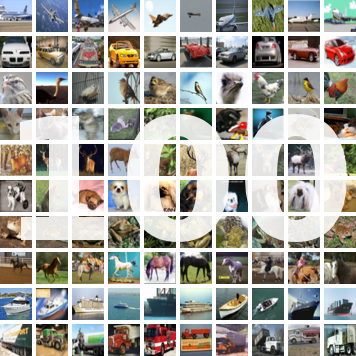

# ImageRecognition
Repository for Image Recognition Challenges

This implements training & test results of the most popular image classifying challenges, including cifar-10, cifar-100, imagenet(ILSVRC-2012).

## Environments
| GPUs         | numbers | nvidia-version | dev    | memory |
|:------------:|:-------:|:--------------:|:------:|:------:|
| GTX 980 Ti   | 1       | 367.57         | local  |   6G   |
| GTX TitanX   | 2       | 372.20         | server |  12G   |

There are two versions of implementations in this repository.
- [Tensorflow version](Tensorflow/)
- [Torch version](Torch/)

## Datasets

### 1. CIFAR-10
CIFAR-10 dataset is consisted with 50,000 training images and 10,000 testing images.
Each image is consisted in an RGB format with the size of 32 x 32 pixels.

There are 10 corresponding labels to each image.
The labels are descripted below.

| Best result network | dropout | Optimizer| Memory | epoch | per epoch    | accuracy(%) |
|:-------------------:|:-------:|----------|:------:|:-----:|:------------:|:-----------:|
| wide-resnet 40x10   |   0.3   | Momentum |  5.8G  | 200   | 3 min 42 sec |    96.31    |

### 2. CIFAR-100
CIFAR-100 dataset is consisted with 50,000 training images and 10,000 testing images.
Each image is consisted in an RGB format with the size of 32 x 32 pixels.

There are 100 corresponding labels to each image.
The labels are descripted below.

| Best result network | dropout | Optimizer| Memory | epoch | per epoch    | Top1 acc(%)| Top5 acc(%) |
|:-------------------:|:-------:|----------|:------:|:-----:|:------------:|:----------:|:-----------:|
| wide-resnet 40x10   |   0.3   | Momentum |  6.9G  | 200   | 3 min 40 sec |    81.23   |    95.47    |

### 3. ILSVRC-2012
ILSVRC(Imagenet Large Scale Visual Recognition Challenge)

### 4. Cat vs Dog, Kaggle Challenge
Cat vs Dog Challenge dataset is consisted with 25,000 training images of cats and dogs with various pixels.
We will automatically split this to make a "skewed dataset".

Unlike the conventional challenge, the optimal goal to this repository is to maximize the accuracy
whilst the skewness of the training data set.

We will consist the training data with 1,000 cats and 10,000 dogs, while consisting the test set with
2,500 cats and 2,500 dogs.

