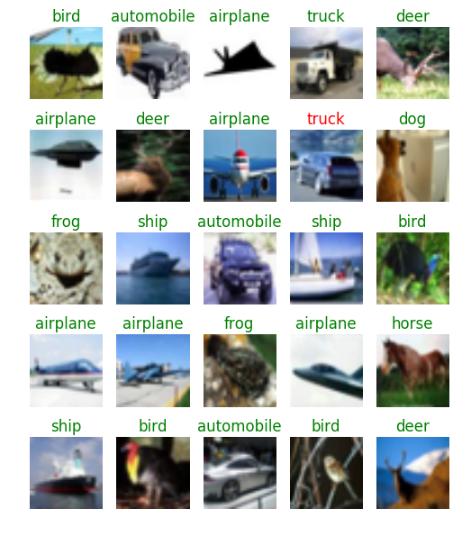

# ImageRecognition
Repository for Image Recognition Challenges

This implements training & test results of the most popular image classifying challenges, including cifar-10, cifar-100, imagenet.

## Requirements
See the [installation instructions](installation.md) for a step-by-step guide.
- Install [Tensorflow-0.11](https://www.tensorflow.org/versions/r0.11/get_started/os_setup.html)
- Install [cuda-8.0](https://developer.nvidia.com/cuda-downloads)
- Install [cudnn v5](https://developer.nvidia.com/cudnn)
- Install [OpenCV](http://docs.opencv.org/2.4/doc/tutorials/introduction/linux_install/linux_install.html)
- For python library dependencies, see [pip list](pip_list.sh).

## Environments
| GPUs       | numbers | nvidia-version | dev    |
|:----------:|:-------:|:--------------:|:------:|
| GTX 980 Ti | 1       | 367.57         | local  |
| GTX 1080   | 2       | 372.20         | server |

## Directories and datasets
There will be 7 directories for basic operation. You will need to create the missing directories ommited by .gitignore

- cifar10 : A directory for python codes and implementations for CIFAR-10 dataset.
- cifar100 : A directory for python codes and implementations for CIFAR-100 dataset. (will be uploaded soon)
- imagenet : A directory for python codes and implementations for ISLVCR-2012 dataset. (will be uploaded soon)
- input : A directory for input datasets.
- models : A directory for saved .ckpt files. This will be ignored by .gitignore.
- notebook : jupyter notebook files for step by step instruction.
- output : A directory for output .csv files for each epoch step.
```bash
mkdir input models output
```

## How to run
You can run cifar-10 training process by running the script below. Details are in [train.py](cifar10/train.py)
```bash
python cifar10/train.py
```

You can test out your trained model by running the script below. Details are in [test.py](cifar10/test.py)
```bash
python cifar10/test.py
```

For configuration of training each dataset, you should look at the [config.py](cifar10/config.py) file.
Detailed descriptions are explained by markdowns.

There are 2 networks available at the current code.
You can find the detailed code description in [network.py](cifar10/network.py) file.
You can change the training network by changing the variable 'mode' in [config.py](cifar10/config.py) file.

The other training scripts for cifar-100 and ISLVCR-2012 will be uploaded soon.

## Optimizers
All the training process is optimized with tf.train.MomentumOptimizer.

The learning rate varies by its global training step(epoch).

|   epoch   | learning rate |  weigth decay |
|:---------:|:-------------:|:-------------:|
|   0 ~ 80  |      0.1      |     0.0005    |
|  81 ~ 120 |      0.02     |     0.0005    |
| 121 ~ 160 |     0.004     |     0.0005    |
| 161 ~ 200 |     0.0008    |     0.0005    |

You can observe that the accuracy increases in a significant quantity every time the learning rate drops.

The gradients are back propagated via several training operations.
These are the list of the training operations. 

| Operation list           | variables                             | description                          |
|--------------------------|---------------------------------------|--------------------------------------|
| apply\_op                | optimizer.computer\_gradients(loss)   | Gradient Descent Optimizer operation |
| batchnorm\_updates\_op   | GraphKeys.MOVING\_AVERAGE\_VARIABLES  | Global Variable Moving Average op.   |

Batch normalization with Exponential Moving Average of 0.5 is implemented.

PReLu(Parametric Rectified Linear Unit) is implemented.

You can see the details in [Implementation details](notebook/README.md)

## CIFAR-10 Results
Below is the result of the test set accuracy for cifar-10 dataset training.

| network           | Optimizer          | Memory | epoch | per epoch    | accuracy(%)     |
|:-----------------:|--------------------|:------:|:-----:|:------------:|:---------------:|
| vggnet(ReLU)      | Momentum Optimizer | 4.81G  | 200   | 1 min 13 sec | 93.45           |
| vggnet(PReLU)     | Momentum Optimizer | 4.81G  | 200   | 1 min 51 sec | 93.70           |
| resnet200         | Momentum Optimizer | -      | 200   |    -         | will be updated |
| wide-resnet 28x10 | Momentum Optimizer | 5.73G  | 200   | 6 min 46 sec | will be updated |

You can see descripted results in the [ipython notebook file](notebook/cifar10_notebook.ipynb)

The predictions colored green are the correct predictions. The predictions colored in red are the incorrect predictions.



## CIFAR-100 Results
Below is the result of the test set accuracy for cifar-100 dataset training.

| network           | Optimizer          | Memory | epoch | per epoch | accuracy        |
|:-----------------:|--------------------|:------:|:-----:|:---------:|:---------------:|
| vggnet            | Momentum Optimizer | -      | 200   |    -      | will be updated |
| resnet64          | Momentum Optimizer | -      | 200   |    -      | will be updated |
| wide-resnet 28x10 | Momentum Optimizer | -      | 200   |    -      | will be updated |

