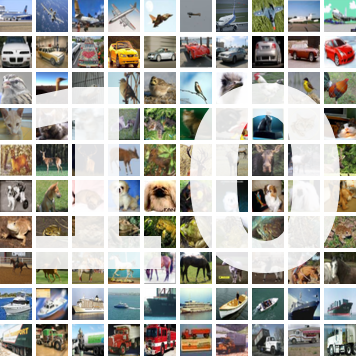
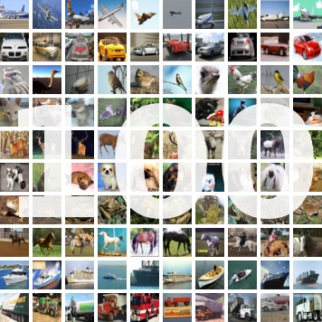
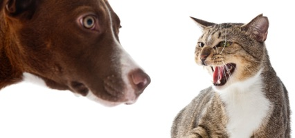

# ImageRecognition - Torch
Repository for Image Recognition Challenges
Torch implementation.

This implements training & test results of the most popular image classifying challenges, including cifar-10, cifar-100, imagenet, and kaggle cat vs dog challenge.

## Requirements
See the [installation instruction](installation.md) for a step-by-step guide.
- Install [Torch](http://torch.ch/docs/getting-started.html)
- Install [cuda-8.0](https://developer.nvidia.com/cuda-downloads)
- Install [cudnn v5](https://developer.nvidia.com/cudnn)
- Install 'optnet'
```bash
luarocks install optnet
```

## Environments
| GPUs         | numbers | nvidia-version | dev    | memory |
|:------------:|:-------:|:--------------:|:------:|:------:|
| GTX 980 Ti   | 1       | 367.57         | local  |   6G   |
| GTX TitanX   | 2       | 372.20         | server |   12G  |

## Directories and datasets
- checkpoints : The optimal stages and models will be saved in this directory.
- datasets : data generation & preprocessing codes are contained.
- models : directory that contains resnet structure file.
- gen : directory where generated datasets are saved in.
- scripts : directory where scripts for each datasets are contained.

## How to run
You can train each dataset which could be either cifar10, cifar100, imagenet, catdog by running the script below.
```bash
./scripts/[cifar10/cifar100/imagenet/catdog]_train.sh
```

## Best Results
|   Dataset   | network           | dropout | Optimizer| Memory | epoch | per epoch    | Top1 acc(%)|
|:-----------:|:-----------------:|:-------:|----------|:------:|:-----:|:------------:|:----------:|
| CIFAR-10    | wide-resnet 28x10 |   0.3   | Momentum |  5.8G  | 200   | 1 min 18 sec |    96.40   |
| CIFAR-100   | wide-resnet 28x10 |   0.3   | Momentum |  6.9G  | 200   | 1 min 18 sec |    81.53   |
| ILSVRC-2012 | wide-resnet 50x2  |    0    | Momentum |  11.2G |  90   |      -       |     -      |
| Cat vs Dog  | wide-resnet 50x2  |    0    | Momentum |  11.2G |  90   |      -       |     -      |

## CIFAR-10 Results



Below is the result of the test set accuracy for **CIFAR-10 dataset** training.
Only conducted mean/std preprocessing.

| network           | dropout | Optimizer| Memory | epoch | per epoch    | accuracy(%) |
|:-----------------:|:-------:|----------|:------:|:-----:|:------------:|:-----------:|
| wide-resnet 28x10 |    0    | Momentum |  4.2G  | 200   | 1 min 18 sec |    96.15    |
| wide-resnet 28x10 |   0.3   | Momentum |  4.2G  | 200   | 1 min 18 sec |  **96.40**  |
| wide-resnet 40x10 |   0.3   | Momentum |  5.8G  | 200   | 1 min 42 sec |    96.31    |
| wide-resnet 40x10 |   0.5   | Moemntum |  5.8G  | 200   | 1 min 42 sec |    96.25    |

CIFAR-10 was updated with the following implementation details.

|   epoch   | learning rate |  weigth decay |
|:---------:|:-------------:|:-------------:|
|   0 ~ 80  |      0.1      |     0.0005    |
|  81 ~ 120 |      0.02     |     0.0005    |
| 121 ~ 160 |     0.004     |     0.0005    |
| 161 ~ 200 |     0.0008    |     0.0005    |


## CIFAR-100 Results



Below is the result of the test set accuracy for **CIFAR-100 dataset** training
Only conducted mean/std preprocessing.

| network           | dropout | Optimizer| Memory | epoch | per epoch    | Top1 acc(%)| Top5 acc(%) |
|:-----------------:|:-------:|----------|:------:|:-----:|:------------:|:----------:|:-----------:|
| wide-resnet 28x10 |    0    | Momentum |  5.1G  | 200   | 1 min 18 sec |     -      |      -      |
| wide-resnet 28x10 |   0.3   | Momentum |  5.1G  | 200   | 1 min 18 sec | **81.55**  |  **95.44**  |
| wide-resnet 40x10 |   0.3   | Momentum |  6.9G  | 200   | 1 min 40 sec |   81.06    |    95.41    |


CIFAR-100 was updated with the following implementation details.

|   epoch   | learning rate |  weigth decay |
|:---------:|:-------------:|:-------------:|
|   0 ~ 80  |      0.1      |     0.0005    |
|  81 ~ 120 |      0.02     |     0.0005    |
| 121 ~ 160 |     0.004     |     0.0005    |
| 161 ~ 200 |     0.0008    |     0.0005    |


## Cat vs Dog Results



Below is the result of the validation set accuracy for **Kaggle Cat vs Dog dataset** training
Unlike CIFAR implements above, we use a bottle-neck layer.

| network           | dropout | Optimizer| Memory | epoch | per epoch    | Top1 acc(%)|
|:-----------------:|:-------:|----------|:------:|:-----:|:------------:|:----------:|
| wide-resnet 40x2  |    0    | Momentum |  1.3G  |  90   | 1 min 34 sec |    97.55   |
| wide-resnet 40x2  |   0.3   | Momentum |  1.3G  |  90   | - min -- sec |      -     |
| wide-botnet 50x2  |   0.3   | Momentum |   -    |  90   | - min -- sec |      -     |

