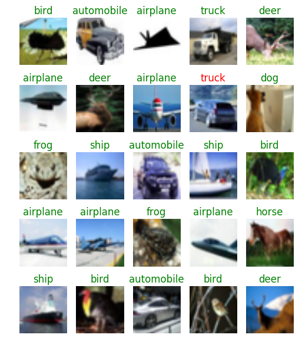

# CIFAR-10 Dataset Implementation Details
Specific Description for CIFAR-10 Dataset training.

CIFAR-10 is consisted with 50,000 training images and 10,000 testing images.
Each images is consisted in an RGB format with the size of 32 x 32 pixels.

## Results
|      network      | Optimizer          | epoch | total time | accuracy(%)     |
|:-----------------:|--------------------|:-----:|:----------:|:---------------:|
|       vggnet      | Momentum Optimizer |  200  |   4:08:25  | 93.45           |
|      resnet200    | Momentum Optimizer |  200  |      -     | will be updated |
| wide-resnet 28x10 | Momentum Optimizer |  200  |   1:57:20  | will be updated |

## Implementation Details
You can see implementation details [here](../notebook/README.md)
